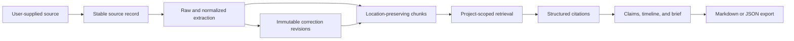

# CiteTrail

**Evidence before prose.** CiteTrail is an open-source, local-first research workspace for collecting
sources, preserving provenance, testing claims against evidence, building timelines, and writing briefs
whose important statements lead back to stored source text.

CiteTrail is deliberately not an autonomous web-research agent or a generic chatbot. You supply the
sources. Deterministic ingestion, extraction, search, evidence linking, timelines, notes, briefs, and
exports continue working when no language model is available.

## What it does

- Creates durable research projects around a primary question.
- Imports manually supplied HTTPS webpages without executing JavaScript or following links.
- Uploads PDF, Markdown, and plain-text files under collision-safe internal names.
- Persists ingestion jobs before returning, reports stage/progress, and automatically recovers interrupted
  or orphaned work after restart.
- Preserves raw extraction, an immutable correction ledger, page/heading/line locations, hashes, warnings,
  historical citations, and revision-aware chunk lineage.
- Searches with SQLite FTS5 plus an offline deterministic semantic baseline and hybrid reciprocal-rank
  fusion.
- Grounds model answers in project-scoped retrieved chunks and validates every Source-style citation marker.
- Verifies quotations and evidence excerpts against stored text.
- Keeps supporting, contradicting, contextual, and uncertain evidence visible side by side.
- Preserves approximate timeline dates as approximate.
- Builds editable briefs one section at a time without silently overwriting user edits.
- Exports Markdown and structured JSON without secrets, prompts, logs, or host paths.
- Creates verified, restorable full-workspace backups without stopping the running application.
- Stages file deletion around the database transaction and repairs interrupted cleanup on restart.

## Provenance-first workflow



Source metadata comes from stored records, never from plausible model prose. A citation proves that an
excerpt exists at a recorded location; it does not prove that the source or claim is true.

## Architecture

CiteTrail is a focused monorepo:

- `apps/api`: Python 3.12, FastAPI, Pydantic, SQLAlchemy, Alembic, SQLite/FTS5, PyMuPDF,
  Trafilatura, BeautifulSoup, httpx, and provider abstractions for Ollama and OpenAI-compatible APIs.
- `apps/web`: React, TypeScript, Vite, Tailwind, TanStack Query, React Router, React Hook Form, Zod,
  react-markdown, and react-pdf/PDF.js.
- `sample_data`: legally redistributable fictional transit research with deterministic conflicts and
  expected results.
- `docs`: architecture, provenance, citations, retrieval, security, responsible AI, development, and
  troubleshooting guides.

See [Architecture](docs/architecture.md) for system diagrams and component responsibilities.

## Quick start

Prerequisites: Python 3.12, Node.js 22+, npm 10+, and SQLite with FTS5 (included by standard CPython
builds).

```bash
cp .env.example .env
python3.12 -m venv .venv
source .venv/bin/activate          # Windows: .venv\Scripts\activate
make api-install
make web-install
make migrate
```

In two terminals:

```bash
make api-dev
make web-dev
```

Open <http://localhost:5173>. API documentation is at <http://localhost:8000/docs>.

### Load the synthetic demo

Generate the included PDF only if you are changing it; the repository already contains the verified
artifact.

```bash
python scripts/generate_sample_pdf.py
make sample
```

`make sample` prints the project ID. Re-running it is idempotent. The demo contains agreement, a direct
contradiction (8,240 vs. 7,510 September weekday boardings), an approximate date, a source without a
named author, a repeated paragraph, and an unresolved causal question.

## Ollama

Ollama is optional. Install it separately, pull a model, and start the local server:

```bash
ollama pull qwen2.5:7b
ollama serve
make provider-health
```

Defaults use `http://127.0.0.1:11434`. Without Ollama, grounded chat displays deterministic retrieved
evidence and every manual workflow remains available.

## Docker

```bash
docker compose up --build
```

Open <http://localhost:8080>. Only a named data volume is mounted. The services bind to loopback by
default. Docker reaches host Ollama through `host.docker.internal`; Linux Compose adds the host-gateway
mapping. Both services run as non-root users with privilege escalation disabled, and the API starts in
production mode. To use another provider or model, copy `.env.example` to `.env` and change the
server-only `CITETRAIL_MODEL_*` values before starting Compose. Do not expose CiteTrail directly to the
public internet: version 1 has no user accounts.

## Development commands

| Task                      | Command                                                                       |
| ------------------------- | ----------------------------------------------------------------------------- |
| Backend install           | `make api-install`                                                            |
| Backend dependency lock   | `make api-lock`                                                               |
| Frontend install          | `make web-install`                                                            |
| Database migrations       | `make migrate`                                                                |
| Backend / frontend dev    | `make api-dev` / `make web-dev`                                               |
| All unit tests            | `make test`                                                                   |
| Lint                      | `make lint`                                                                   |
| Format                    | `make format`                                                                 |
| Type check                | `make typecheck`                                                              |
| Frontend production build | `make build`                                                                  |
| Playwright E2E            | `cd apps/web && npm run test:e2e`                                             |
| Load demo                 | `make sample`                                                                 |
| Offline workspace backup  | `make backup` or `make backup BACKUP_PATH=/protected/research.ctbackup`       |
| Restore backup            | Stop CiteTrail, then `make restore RESTORE_PATH=/protected/research.ctbackup` |
| Provider check            | `make provider-health`                                                        |
| Reset all local data      | `make reset` (requires typing `RESET`)                                        |

## Backups and restore

Settings can download a complete `.ctbackup` workspace while CiteTrail is running. The archive contains a
consistent SQLite snapshot, every upload referenced by that snapshot, local vector files, an exact file
manifest, sizes, and SHA-256 integrity checks. It contains private source bodies and should be stored in an
encrypted, access-controlled location. Project Markdown/JSON exports are safer for sharing, but they are
not restorable backups.

Restore is deliberately offline. Stop the API or run `docker compose down`, inspect the archive if desired,
then restore:

```bash
python scripts/restore_backup.py /protected/research.ctbackup --inspect
make restore RESTORE_PATH=/protected/research.ctbackup
make migrate
```

Restore rejects traversal paths, links, encrypted or undeclared entries, size/checksum mismatches, corrupt
SQLite, and non-CiteTrail databases before changing the workspace. It keeps the previous database,
uploads, and vectors in a timestamped sibling directory for manual rollback. Checksums detect corruption;
they are not a cryptographic signature proving who created an archive.

For the named Docker volume, use the operational command bundled into the API image:

```bash
docker compose down
docker compose run --rm \
  -v "/absolute/path/research.ctbackup:/restore.ctbackup:ro" \
  api python -m app.cli.restore /restore.ctbackup --data-dir /data --confirm REPLACE
docker compose up -d
```

## Configuration

All backend variables use the `CITETRAIL_` prefix. Values below are defaults.

| Variable                       | Default                         | Purpose                                                        |
| ------------------------------ | ------------------------------- | -------------------------------------------------------------- |
| `DATA_DIR`                     | `~/.local/share/citetrail`      | SQLite, uploads, and derived local data outside the repository |
| `CORS_ORIGINS`                 | `http://localhost:5173`         | Exact browser origins allowed                                  |
| `ALLOW_HTTP_URLS`              | `false`                         | HTTPS-only import policy                                       |
| `MAX_REDIRECTS`                | `5`                             | Validated redirect ceiling                                     |
| `REQUEST_TIMEOUT_SECONDS`      | `20`                            | Remote retrieval timeout                                       |
| `MAX_DOWNLOAD_BYTES`           | `20971520`                      | Maximum remote body                                            |
| `MAX_UPLOAD_BYTES`             | `52428800`                      | Maximum uploaded file                                          |
| `MAX_EXTRACTED_CHARS`          | `2000000`                       | Extraction text ceiling                                        |
| `MAX_PDF_PAGES`                | `1000`                          | PDF page-count ceiling                                         |
| `CHUNK_SIZE` / `CHUNK_OVERLAP` | `1200` / `150`                  | Provenance-preserving chunk shape                              |
| `INGESTION_POLL_SECONDS`       | `0.5`                           | Durable queue polling interval for the embedded worker         |
| `SEMANTIC_SEARCH_ENABLED`      | `true`                          | Enable deterministic local semantic and hybrid retrieval       |
| `EMBEDDING_MODEL`              | `deterministic-feature-hash-v1` | Honest identifier for the no-download baseline                 |
| `MODEL_PROVIDER`               | `ollama`                        | `ollama` or `openai_compatible`                                |
| `MODEL_BASE_URL`               | `http://127.0.0.1:11434`        | Provider endpoint                                              |
| `MODEL_NAME`                   | `qwen2.5:7b`                    | Provider model                                                 |
| `MODEL_API_KEY`                | empty                           | Server-only optional credential                                |

The optional `semantic` backend extra installs ChromaDB and sentence-transformers for future/high-scale
embedding adapters. Version 1 stores deterministic local embeddings with each chunk so clean setup and
CI require no model download.

## Testing

Backend tests use isolated SQLite databases, temporary storage, mocked model providers, synthetic PDFs,
and mocked HTTP transports—never arbitrary public websites. Frontend tests mock the versioned API.
Playwright covers the synthetic end-to-end workflow using a deterministic mocked source/provider server.

CI requires no API keys, Ollama, GPU, or private files.

## Security and privacy summary

- URL validation rejects credentials, unsupported schemes, localhost, loopback, private, link-local,
  multicast, reserved, unspecified, and known cloud-metadata addresses. Every redirect is revalidated.
- Each URL and redirect is resolved and the TCP connection is pinned to a validated public address while
  the original hostname remains authoritative for HTTP and TLS certificate verification.
- Retrieval sends no cookies, uses no authenticated session, disables environment proxies, requests
  identity encoding, and enforces MIME, timeout, redirect, declared-length, and streamed-body limits.
- Uploaded file names never become storage paths. Content and extension are checked; PDF delivery is
  same-origin, sandboxed, and `nosniff`.
- Source HTML is never served or rendered. The UI displays stored text and react-markdown skips raw HTML.
- Model prompts isolate untrusted excerpts, give models no tools, and tell them not to follow embedded
  instructions. Prompt-injection defenses reduce risk but do not guarantee complete protection.
- Remote providers receive selected source excerpts. Their API keys remain server-side.
- One process exclusively owns a data directory; live backups serialize upload/deletion file-set changes,
  and restore refuses to run while CiteTrail owns the workspace.

Read [Security model](docs/security-model.md) before changing network, upload, rendering, or provider code.

## Responsible AI

Generated summaries can omit context or be wrong. Multiple sources can repeat the same error. Source
signals are context, not truth scores. Absence of evidence is not evidence of absence. Dates,
contradictions, claims, and model-generated prose require human review. See
[Responsible AI](docs/responsible-ai.md).

## Known limitations

- Single-user local deployment only; there is no authentication or public sharing.
- No OCR for image-only PDFs, JavaScript webpage rendering, crawling, authenticated pages, search-engine
  integration, or citation-style engine.
- The deterministic semantic baseline is feature hashing rather than a learned language embedding. The
  provider boundary and optional dependency group are ready for a Chroma/sentence-transformers adapter.
- IP-pinned retrieval is still an application-layer control, not a network sandbox. Hostile deployments
  should additionally deny protected address ranges with an outbound firewall or proxy.
- Ingestion jobs are durable and restart-recoverable, but version 1 intentionally runs one embedded worker
  in one API process. Horizontal workers and distributed leasing are not supported.
- Model answer streaming and model-assisted record suggestion endpoints are not part of this initial
  implementation; deterministic/manual workflows are complete.
- Backup manifests provide corruption detection, not archive authenticity or encryption. Protect backup
  files with operating-system or encrypted-storage controls.

## Roadmap

1. Optional multi-worker ingestion with explicit leases for larger deployments.
2. Optional Chroma/sentence-transformers adapter with explicit model-download consent.
3. Citation-aware answer streaming and structured suggestion review queues.
4. Optional OCR extension for image-only pages.

Contributions are welcome—read [CONTRIBUTING.md](CONTRIBUTING.md). CiteTrail is available under the
[MIT License](LICENSE).
