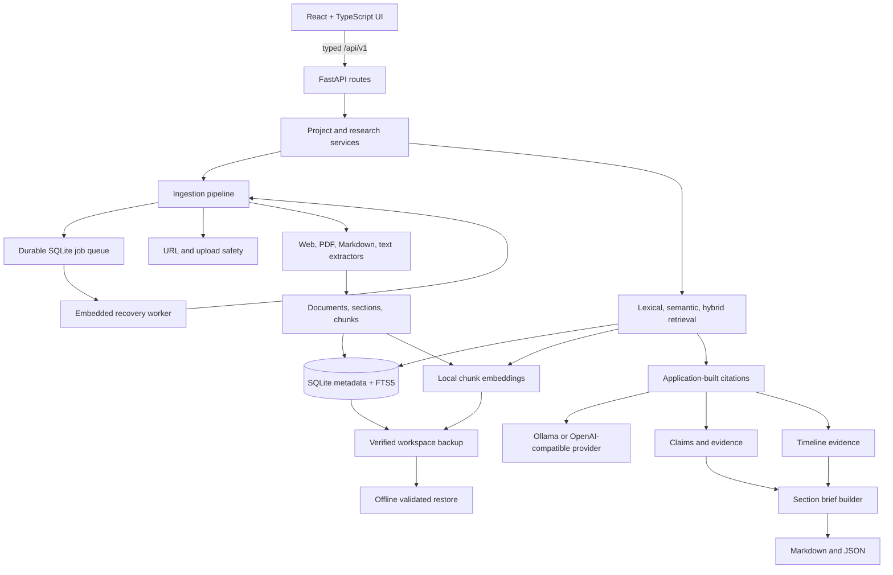

# Architecture

CiteTrail is a local single-user React application backed by one FastAPI process. Boundaries are kept in
code, not multiplied into services.

## Frontend

React Router defines Dashboard, New Project, Overview, Sources, Source Detail, Search, Research Chat,
Claims, Evidence Matrix, Timeline, Notes, Brief Builder, Exports, History, and Settings. TanStack Query
owns server state. React Hook Form and Zod validate structured forms. `react-markdown` ignores raw HTML;
PDF.js receives a same-origin sandboxed PDF response.

## API and storage

FastAPI exposes typed Pydantic requests and responses under `/api/v1`. SQLAlchemy models use UUID string
identifiers, foreign keys, indexes, uniqueness constraints, and cascading cleanup. Alembic owns the
schema. Application metadata, normalized text, citations, and research records live in SQLite. Uploaded
files live under generated storage keys in the configured data directory.

One advisory lock gives a data directory exactly one owning CiteTrail process. A live backup uses SQLite's
online backup API for a consistent database snapshot, then packages every upload referenced by that
snapshot and all local vector files. Upload and deletion file-set mutations are serialized while the
archive is assembled. The manifest records exact paths, byte counts, and SHA-256 hashes.

Restore is an offline operation. It validates archive paths and membership, rejects links and encrypted
entries, verifies every size/hash and SQLite integrity, extracts without `extractall`, and only then swaps
the database/uploads/vectors into place. The previous workspace is retained beside the data directory for
manual rollback.

## Ingestion and extraction

Sources transition through queued/retrieving/uploaded/extracting/indexing/ready states. Upload and webpage
routes commit a `ProcessingJob` before returning `202`; request completion is therefore not the lifetime
boundary of ingestion. One embedded worker atomically claims queued jobs, commits stage/progress changes,
and marks the same attempt complete or failed. Startup requeues interrupted jobs and reconstructs missing
jobs for nonterminal sources left by older versions. A partial unique index permits only one queued/running
job per source, while retries remain numbered history.

Web retrieval and file storage are isolated from parsing. CPU-bound file extraction and indexing run
outside the API event loop. Extractors return one `ExtractedDocument` contract containing raw text,
normalized text, sections, explicitly observed metadata, location, method, and warnings. The indexer is
the only component that creates chunks and FTS/embedding records. Corrections append immutable revision
records, rebuild sections, activate the new chunk set, and retain superseded chunks outside retrieval so
historical citations and evidence keep their referential lineage.

## Retrieval

FTS5 provides phrase/lexical candidates. Deterministic offline feature hashing provides a no-download
semantic baseline. Hybrid retrieval uses reciprocal-rank fusion, deduplicates excerpts, and keeps all
queries inside the project and optional selected-source boundary.

## Providers and generated work

Provider classes isolate availability, request shape, locality disclosure, timeouts, and normalized
errors. The user question and untrusted evidence records are serialized as JSON data, and model output
must validate as a one-field JSON object before citation processing. If the provider fails or returns
malformed output, deterministic evidence retrieval remains available. Claims, timelines, and brief
sections are records independent of model runs.

## Exports

Export services traverse stored records rather than generated prompt text. They omit secrets, prompts,
logs, storage keys, and local paths. JSON full text—including correction revision text—is opt-in; both
Markdown and JSON label the source revision used by evidence.

Exports are portable research representations and intentionally omit internal storage details. A
`.ctbackup` is different: it is a private operational recovery artifact containing the complete local
workspace and is not intended for sharing.
