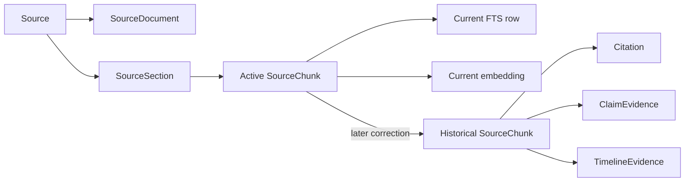

# Provenance model

## Identity and extraction

Every imported item receives a stable `Source.id` inside one project. The source record holds its original
name or URL, normalized/final URL, explicit metadata, retrieval/upload time, content hash, extraction
method, status, warnings, and user context. Missing author, publisher, or date remains `null`/unknown.

`SourceDocument.raw_text` is the first stored extraction. `normalized_text` is the original
whitespace-normalized extraction. The current searchable correction is stored separately without
overwriting either original field.

## Correction revisions

Every saved correction creates an immutable `SourceCorrectionRevision` with a monotonically increasing
revision number, required review note, before/after SHA-256 hashes, timestamp, alignment method,
confidence, and location status. The full revision text remains in the local database. The Source Detail
ledger and default JSON export expose its audit metadata; full correction text is included in JSON only
when full-text export is explicitly requested.

Markdown, webpage, and plain-text corrections are reparsed to recover headings and line ranges. PDF
corrections are aligned against the preceding searchable revision. When alignment confidence is at least
0.75, chunks retain the corresponding original page assignments and the source receives an explicit
review warning. When confidence is lower—or original boundaries cannot be recovered—the correction is
indexed without page numbers rather than presenting uncertain locations as facts.

## Chunk lineage

Each chunk retains project/source identifiers, ordinal, occurrence hash, character offsets, PDF page,
heading path, and line range where available. Repeated passages remain separate chunk occurrences so a
later page, heading, or line location is not erased. Only active chunks participate in lexical, semantic,
or hybrid retrieval. A correction deactivates superseded chunks instead of deleting them, so existing
foreign-key-backed evidence and citations remain resolvable.

## Evidence, claim, and timeline lineage

Evidence links store source ID, optional chunk ID, the source text revision used for verification, exact
verified excerpt, relationship, confidence, origin, location, and notes. Citations and timeline evidence
also capture the source revision. Source, chunk, note, claim, and timeline links cannot cross project
boundaries. Every API-created timeline event requires verified source evidence; model suggestions must
remain suggested until a user reviews them. Approximate date wording is retained in `date_label`.

## Export lineage

Exports serialize stable IDs, correction audit metadata, source revision numbers, and evidence
relationships directly from the database. JSON schema `1.1` includes correction history and makes all
revision text opt-in. Exports do not infer missing attribution, include internal storage keys, or
reconstruct citations from model prose.
